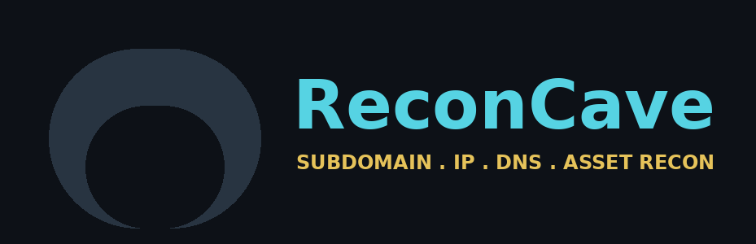

# ReconCave



[](LICENSE)
[](docs/installation.md)
[](CHANGELOG.md)

**Subdomain, IP, DNS, and asset recon for a domain — in one tool.**

ReconCave crawls a target site, passively discovers subdomains via
certificate transparency logs, resolves DNS, probes what's actually
alive, and optionally checks TLS certs, HTTP headers, email security
(SPF/DMARC), ASN/org ownership, and dangling-CNAME subdomain takeovers —
then writes it all out as JSON, CSV, TXT, or a self-contained offline
HTML report.

> ⚠️ **Only run this against domains you own or are explicitly authorized
> to test.** ReconCave only uses passive, publicly available data
> (certificate transparency logs, plain DNS) and normal HTTP requests —
> it does not exploit or attack anything — but running it against systems
> you don't have permission to assess may violate their terms of service
> or the law in your jurisdiction.

## Features

- Same-domain crawler (concurrent, depth-limited, robots.txt-respecting)
- Passive subdomain discovery via [crt.sh](https://crt.sh) certificate transparency logs
- DNS resolution (IPv4/IPv6) + wildcard-DNS detection to avoid false positives
- Live HTTP probing of every discovered host
- TLS certificate metadata (issuer, expiry) for live HTTPS hosts
- HTTP response header capture
- Dangling-CNAME / subdomain-takeover detection
- Email security posture: SPF, DMARC, MX
- Optional ASN/organization lookup per IP
- Scan-over-scan diffing — see what's new since last time
- JSON / CSV / TXT / self-contained offline HTML output
- Interactive menu **and** a fully scriptable flag-driven CLI
- Config file support, `--verbose`/`--quiet`/`--log-file`, never overwrites a previous report

## Install

Requires Python 3.9+.

### Windows (PowerShell)

```powershell
git clone https://github.com/paula07x/reconcave.git
cd reconcave
pip install -e ".[full]"
reconcave --version
```

If the last line prints `reconcave: command not found` or similar,
Python's user script folder isn't on your `PATH`. Add it for the current
session and verify:

```powershell
$scriptsPath = (python -m site --user-site) -replace 'site-packages$', 'Scripts'
$env:Path += ";$scriptsPath"
reconcave --version
```

To make that permanent, add the same path via *System Properties →
Environment Variables → Path* (Windows' PATH-persistence step isn't
scriptable the same way Linux/macOS `.rc` files are).

### Linux / macOS

```bash
git clone https://github.com/paula07x/reconcave.git && cd reconcave && pip install -e ".[full]" && case "$SHELL" in */zsh) RCFILE="$HOME/.zshrc" ;; */bash) RCFILE="$HOME/.bashrc" ;; *) RCFILE="$HOME/.profile" ;; esac && grep -qxF 'export PATH="$HOME/.local/bin:$PATH"' "$RCFILE" || echo 'export PATH="$HOME/.local/bin:$PATH"' >> "$RCFILE" && export PATH="$HOME/.local/bin:$PATH" && reconcave --version
```

That single block clones the repo, installs it, detects whether you're
on `bash` or `zsh`, adds `~/.local/bin` to `PATH` permanently in the
right config file (only if it isn't already there — safe to run more
than once), applies it to your current session immediately, and prints
the version to confirm it worked. If `reconcave --version` at the end
doesn't print a version number, close the terminal completely and open
a new one — some terminals don't fully reload after a `.rc` file change.

`[full]` adds optional libraries (`dnspython`, `tldextract`, `pyfiglet`,
`colorama`) that unlock a few extra checks and a nicer banner — the core
tool works without them too, just with fewer enrichment features. Full
breakdown: [docs/installation.md](docs/installation.md).

On Debian/Kali specifically, `python3 -m venv` sometimes fails with
`ensurepip is not available` and points at a `python3.X-venv` package
that doesn't actually exist in the repos — if that happens, skip the
venv entirely and use the block above as-is; it works correctly without
one (falls back to a user-level install).

### Running it without installing anything

No install step is required at all if you'd rather not — from inside
the cloned folder:

```bash
python3 reconcave/cli.py example.com
```

This runs the exact same code as the installed `reconcave` command.
Useful for a quick one-off check, or if you're just browsing the code.

### Updating

```bash
cd reconcave && git pull && pip install -e ".[full]" && reconcave --version
```

Re-running the install step is always safe even when no dependency
changed — it's only strictly necessary when one has (check
[CHANGELOG.md](CHANGELOG.md) if curious), but there's no harm in always
including it.

## Getting started

ReconCave has two interfaces to the same code. Use whichever fits.

### 1. Interactive menu

Run with no arguments:

```bash
reconcave
```

This opens a banner and a menu with named scan types — Fast search, Deep
search, Related domains only, Email info, Website info, Everything, or
Custom — each prompting for a target and output format (JSON/HTML).
Ctrl+C stops any running scan at any time and returns you to the menu.

### 2. Direct CLI (scriptable)

```bash
reconcave example.com                          # crawl + full recon, JSON output
reconcave example.com --no-crawl               # pure subdomain/IP recon, fast
reconcave example.com --format html            # local, offline HTML report
reconcave example.com --asn --tls --cname-check --dns-records --email
reconcave example.com --filter staging         # only hosts containing "staging"
reconcave example.com --include-subdomains --depth 3
reconcave example.com --quiet --log-file scan.log
reconcave --help                                # full flag reference
```

Reports save to a `results/` folder next to the tool, never overwriting
a previous scan of the same target. Full flag reference and config file
docs: [docs/usage.md](docs/usage.md).

## Docs

- [Installation](docs/installation.md)
- [Usage](docs/usage.md) — every flag, the interactive menu, config files, output formats
- [Architecture](docs/architecture.md) — how the pipeline fits together
- [Module reference](docs/modules.md)
- [Changelog](CHANGELOG.md)
- [Contributing](CONTRIBUTING.md) · [Security policy](SECURITY.md) · [Code of Conduct](CODE_OF_CONDUCT.md)

## Development

```bash
pip install -e ".[dev]"
pytest
```

See [CONTRIBUTING.md](CONTRIBUTING.md) for the full workflow.

## License

MIT — see [LICENSE](LICENSE).
